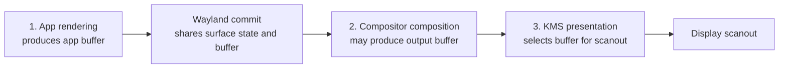
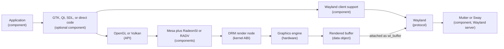
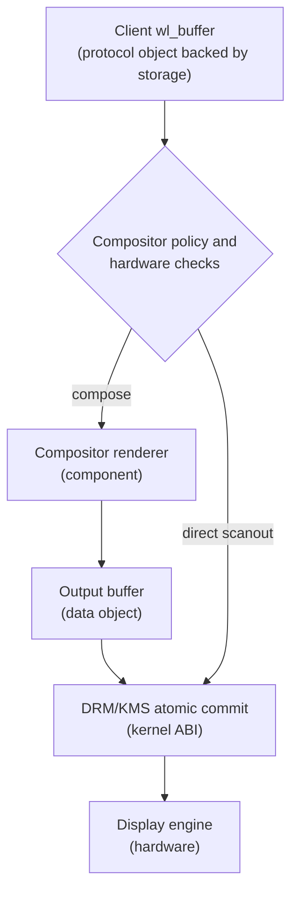
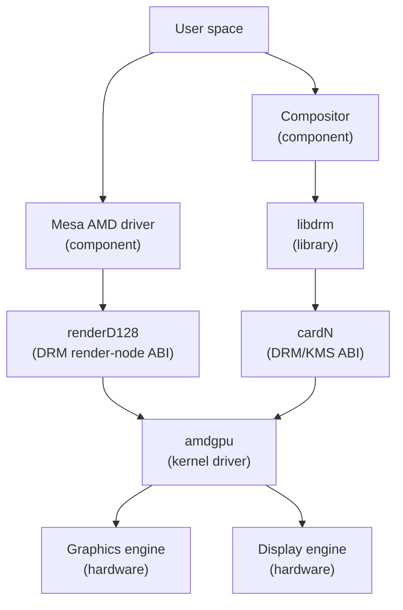
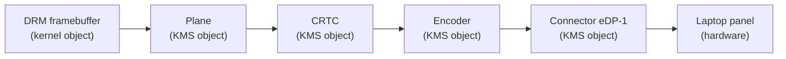
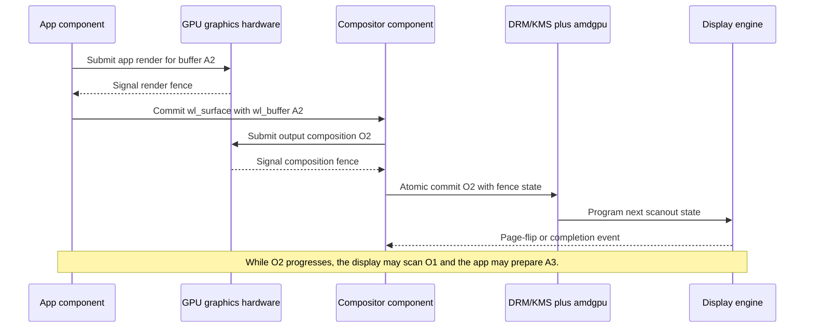
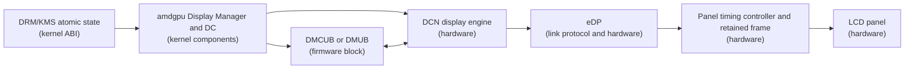

# Penfold research brief: from a frozen Telegram photo to the Linux graphics stack

Status: ready for Casper

Research date: 2026-08-30

## Editorial brief

### Audience

Write for Linux users who know processes, files, and the user/kernel split, but do not yet know the graphics stack. Define each graphics term before using it to explain another term.

### Goal

Use one Framework Laptop display freeze as the hook for a durable guide to Linux graphics. The reader should finish with a clear model of three stages:

1. An application renders a buffer.
2. A compositor may compose application buffers into an output buffer.
3. The compositor presents a buffer through DRM/KMS for scanout.

The article must also teach the difference between a running component and a specification or interface.

### Main thesis

The visible desktop comes from several cooperating systems. OpenGL and Vulkan describe rendering work. Wayland carries surface state and buffer references. Mesa implements graphics APIs. Mutter or Sway makes window and composition choices. DRM/KMS exposes kernel graphics and display control. `amdgpu` implements those kernel interfaces for AMD hardware. DMCUB firmware and the display engine sit near the final display path.

The incident failed in the AMD display path. The logs do not prove that Vulkan rendering, Mutter, direct scanout, PSR, or firmware alone caused the first fault.

### Progressive disclosure

Use this order:

1. Show the symptom and five decisive log lines.
2. Give the smallest useful three-stage diagram.
3. Add the Wayland buffer handoff.
4. Split the DRM render path from the KMS display path.
5. Add AMD-specific driver, firmware, and hardware blocks.
6. Explain PSR and direct scanout only after normal composition is clear.
7. Return to the logs and mark facts, inferences, and unknowns.
8. End with a glossary and repeatable log-reading method.

Do not place the full stack diagram before the small three-stage model.

### In scope

- Native Wayland on Linux.
- GTK and Qt as common optional client toolkits.
- Direct OpenGL or Vulkan clients.
- Mesa RadeonSI and RADV.
- DRM render nodes, the primary DRM node, DMA-BUF, `wl_buffer`, and fences.
- Mutter and Sway, with wlroots as a compositor library used by Sway.
- DRM/KMS atomic presentation through `amdgpu`.
- AMD Display Core, DCN, DMCUB, the display engine, eDP, and PSR.
- Normal composition, hardware planes, and direct scanout.
- The observed crash and the later Dawn warnings.

### Out of scope

- A full X11 or Xorg history.
- Shader languages and 3D pipeline internals.
- Video decode blocks such as VCN.
- Detailed memory allocation, tiling, and format-modifier negotiation.
- A claim that the incident has a proven upstream root cause.
- Benchmark claims about OpenGL, Vulkan, Wayland, or direct scanout.

## Accuracy rules for the draft

1. Do not call Wayland a renderer or composition API. It is a protocol between clients and a compositor, plus reference C libraries.
2. Do not call Xorg a protocol. X11 is the protocol. Xorg is one server implementation.
3. Do not place Mesa between KMS and `amdgpu`. Mesa uses DRM rendering interfaces. A compositor separately uses KMS for presentation.
4. Do not say Mesa and KMS are alternatives. They often take part in the same frame at different stages.
5. Do not imply one composition and one presentation for every application frame. The compositor builds output frames from the latest usable buffers. It may reuse or skip an application buffer.
6. Do not call every shared pixel buffer a DMA-BUF. `wl_shm` is also valid. A DMA-BUF file descriptor is a common handle for GPU-accessible shared storage. A `wl_buffer` is the Wayland object that represents content attached to a surface.
7. Do not say a fence contains pixels. A fence signals completion or ownership state for asynchronous work.
8. Do not say direct scanout bypasses the compositor. The compositor still receives the surface, checks policy and hardware constraints, and asks KMS to scan out the client buffer.
9. Do not say KMS renders. KMS configures display state. Hardware planes can blend or scale during scanout, but this is not the application or compositor render job described by OpenGL or Vulkan.
10. Do not call `libdrm` a driver. It is a user-space library that wraps many DRM ioctls and supplies shared definitions and helpers.
11. Do not equate an integrated GPU with dedicated VRAM. This Radeon 780M uses shared system memory, though the graphics stack still speaks in terms of buffer objects and GPU addresses.
12. Treat "DMCUB caused the crash" as shorthand. The strong fact is that the AMD display driver logged repeated DMCUB failures and display-block timeouts. The first corrupt state may come from firmware, kernel display code, hardware, or their interaction.

## Type legend

Use this table near the start of the reference section.

| Name | Type | What it does |
|---|---|---|
| Brave, a GTK app, a Qt app | User-space component | Runs application logic and produces window content. |
| GTK, Qt, SDL, GLFW | User-space libraries or frameworks | Provide UI, window-system integration, input handling, and often a renderer. They are optional. |
| OpenGL, Vulkan | Graphics API specifications | Define rendering and compute operations. They are not processes or drivers. |
| Mesa | User-space graphics project and runtime components | Supplies Linux implementations of graphics APIs and GPU-specific user-space drivers. |
| RadeonSI | Mesa user-space driver component | Implements OpenGL for supported AMD GPUs through Mesa's Gallium stack. |
| RADV | Mesa user-space driver component | Implements Vulkan for supported AMD GCN and RDNA GPUs. |
| Wayland core and extensions | Protocol specifications | Define requests and events between clients and a compositor. |
| `libwayland-client`, `libwayland-server` | User-space libraries | Marshal and dispatch Wayland protocol messages. Toolkits often hide these details. |
| `wl_surface`, `wl_buffer` | Wayland protocol objects | Represent surface state and attachable content from the protocol's point of view. |
| Mutter, Sway | User-space components | Act as Wayland servers, compositors, and window managers. |
| wlroots | User-space library | Supplies reusable compositor backends, renderers, buffer support, and Wayland protocol support. Sway uses it. |
| DMA-BUF | Kernel sharing framework and exported object | Lets processes and devices share buffer storage through file descriptors. |
| `dma_fence`, sync file, DRM sync object | Synchronization primitives or objects | Signal completion and coordinate asynchronous access to buffers. |
| `libdrm` | User-space library | Wraps many DRM ioctls and provides DRM data types and helpers. |
| DRM | Linux kernel framework and user-space ABI | Provides graphics device nodes, memory and buffer management, command submission, synchronization, and display interfaces. |
| DRM render node, such as `renderD128` | Device file interface | Allows unprivileged rendering without modesetting or DRM master. |
| DRM primary node, such as `card1` | Device file interface | Exposes KMS and other primary-node operations subject to access control. The number is not stable. |
| KMS | DRM display-control API and framework | Controls framebuffers, planes, CRTCs, connectors, modes, and atomic display state. |
| `amdgpu` | Linux kernel driver component | Implements AMD-specific DRM rendering and KMS operations and manages AMD GPU IP blocks. |
| AMD Display Core, often DC | Kernel driver subsystem inside `amdgpu` | Translates DRM display state into AMD display-pipeline state. |
| DCN 3.1.4 | AMD display hardware generation | The display controller generation reported on this Radeon 780M system. |
| DMCUB or DMUB | AMD display firmware and microcontroller block | Runs display firmware and handles commands for display features. Kernel docs use both spellings in interfaces and logs. |
| GPU graphics engine | Hardware | Executes drawing, shader, and compute command streams. |
| Display engine | Hardware | Fetches scanout buffers, processes display planes, and drives output links. |
| eDP | DisplayPort-derived link protocol and physical link | Connects the integrated GPU display engine to the laptop panel. |
| PSR | eDP feature and state machine | Lets a capable panel retain an unchanged frame so parts of the source display path can save power. |
| Framebuffer or render target | Data object and storage interpretation | Holds pixels produced by rendering or selected for display. A KMS framebuffer is also a DRM object that refers to backing storage. |

## The exact conceptual model

### Stage 1: application rendering

The application or its toolkit records work through OpenGL, Vulkan, or a CPU renderer. With AMD GPU rendering, Mesa's RadeonSI or RADV user-space driver sends hardware-specific work through DRM rendering interfaces to `amdgpu`. The GPU writes pixels into buffer storage and signals completion.

```text
application component
  -> optional toolkit or renderer component
  -> OpenGL or Vulkan API
  -> Mesa user-space driver component
  -> DRM render-node ABI
  -> amdgpu kernel component
  -> GPU graphics hardware
  -> pixel buffer plus synchronization state
```

GTK or Qt is not a mandatory hop. A game may use SDL, GLFW, or Wayland and Vulkan directly. A toolkit may also choose a CPU renderer.

### Wayland handoff between stages

The client attaches a `wl_buffer` to a `wl_surface`, marks damage as needed, and commits surface state. For accelerated buffers, the Linux DMA-BUF protocol can create the `wl_buffer` from DMA-BUF file descriptors. The protocol transfers object state and handles. It does not transfer OpenGL or Vulkan draw calls.

```text
application or toolkit, acting as a Wayland client
  -> libwayland-client or generated client bindings
  -> Wayland requests over a Unix-domain socket
  -> Mutter or Sway, acting as the Wayland server
```

The compositor sends events in the other direction, including input, configuration, frame callbacks, and buffer release. Wayland is asynchronous.

### Stage 2: compositor composition

The compositor imports visible client buffers and chooses an output plan. In the normal path it asks its renderer to sample those buffers and draw a final output buffer. A GPU renderer can use Mesa through OpenGL, OpenGL ES, or Vulkan. A software renderer can use the CPU.

```text
committed client buffers
  -> compositor component and scene graph
  -> compositor renderer component
  -> graphics API and Mesa, or CPU renderer
  -> output buffer plus synchronization state
```

Composition is optional. Direct scanout can present a suitable client buffer without drawing a new output buffer. Hardware overlay planes can also put more than one buffer into the display pipeline without first flattening all pixels in a GPU render job.

### Stage 3: presentation and scanout

The compositor creates an atomic KMS state. It assigns DRM framebuffers to planes, connects planes to a CRTC, selects connectors and a mode, and supplies synchronization state. It normally uses `libdrm` wrappers, though direct ioctls are possible. `amdgpu` validates and applies the state through AMD Display Core. The display engine fetches pixels and sends a stream over eDP to the panel.

```text
selected output or direct-scanout buffer
  -> compositor component
  -> libdrm library
  -> DRM/KMS atomic ABI
  -> amdgpu and AMD Display Core kernel components
  -> DMCUB firmware where the display feature requires it
  -> display engine hardware
  -> eDP link
  -> panel hardware
```

### Dependency and overlap

For one specific buffer, the dependencies are ordered:

```text
render buffer -> make it available -> compose or select it -> present it -> scan it out
```

The system pipelines different work. An app can render a newer buffer while the display scans an older output frame. Several apps can render independently. A compositor can reuse the same client buffer across many output frames or never show an intermediate client buffer. Fences and release events protect buffer use.

## Proposed Mermaid diagrams

Casper should put each diagram before the prose that explains it. Keep the type words visible in node labels until the reader knows the legend.

### Diagram 1: the smallest model

Purpose: establish the three stages without naming every layer.



Caption: These are dependency stages for a buffer, not three processes and not a strict machine-wide schedule.

### Diagram 2: one app has two parallel interfaces

Purpose: stop the common mistake that rendering goes through Wayland.



Caption: The paths meet at the buffer reference and its synchronization state.

### Diagram 3: normal composition and direct scanout

Purpose: show that presentation stays under compositor control in both cases.



Caption: Direct scanout skips the compositor's render job. It does not skip the compositor or KMS.

### Diagram 4: DRM has two related branches

Purpose: answer whether Mesa goes through KMS.



Caption: Mesa output can later be presented through KMS, but Mesa rendering calls do not travel through the KMS API.

### Diagram 5: KMS display objects

Purpose: replace the vague phrase "show this buffer" with the core atomic objects.



Caption: One or more planes feed a CRTC. The connector represents the display sink. The exact internal hardware path is richer than the stable KMS model.

### Diagram 6: asynchronous pipeline across frames

Purpose: show ordered dependencies without claiming global serial execution.



### Diagram 7: AMD display path and PSR

Purpose: place DMCUB near the display path without placing it in every rendering command.



Caption: PSR lets a capable panel retain an unchanged frame. The source can then reduce repeated memory fetches and link activity until content changes.

### Diagram 8: incident timeline

Purpose: distinguish the first fault from later suspend fallout.

```mermaid
flowchart LR
    T1["11:15:04<br/>Mutter stacking assertion"] --> T2["11:15:08<br/>first DMCUB errors"]
    T2 --> T3["11:15:09<br/>MPCC idle timeout"]
    T3 --> T4["11:15:33<br/>DMUB command queue errors"]
    T4 --> T5["11:16:18<br/>power key starts suspend"]
    T5 --> T6["11:16:22<br/>PSR call trace in KMS thread"]
    T6 --> T7["11:17:24<br/>user.slice freeze times out"]
    T7 --> T8["11:18:17<br/>CRTC blank fails"]
    T8 --> T9["11:25 to 11:28<br/>more suspend and display failures"]
    T9 --> T10["11:29:35<br/>new boot"]
```



Caption: The PSR trace happened after the DMCUB fault, during a user-triggered suspend. It links the stuck display path to PSR handling, but does not prove that PSR caused the first fault.

## Incident evidence

### System snapshot from the previous boot

Local journal and package data showed:

- Framework Laptop 13, AMD Ryzen 7040 Series.
- AMD Radeon 780M integrated GPU, Phoenix, RDNA 3.
- Kernel `7.1.6-201.fc44.x86_64` during the fault.
- `amdgpu` reported Display Core `3.2.378` on DCN `3.1.4`.
- DMCUB firmware version `0x08005D00` loaded through PSP.
- Internal connector `eDP-1` reported PSR support.
- Mutter package `50.3-3.fc44` and Mesa packages `26.1.5-1.fc44` were installed when inspected.
- BIOS `03.18` appeared in the kernel trace.

These facts describe this machine at that time. Do not turn package versions into general advice without checking current Fedora and Framework sources again at publication time.

### Condensed timeline

| Time | Observed log evidence | Interpretation | Confidence |
|---|---|---|---|
| 11:15:04.809 | Mutter logged `meta_window_set_stack_position_no_sync` assertion failure. | A compositor-side state warning occurred during the reported fullscreen action. Temporal relation is strong. Causation is not shown. | High for event, low for cause |
| 11:15:08.363 | First `DMCUB error - collecting diagnostic data`. | The AMD display path detected a DMCUB failure about 3.6 seconds later. | High |
| 11:15:09.126 | `REG_WAIT timeout ... mpc2_assert_idle_mpcc`. | A display composition block did not reach its expected idle state. | High |
| 11:15:33.059 | First `Error queueing DMUB command: status=2`, then repeated errors. | The driver could no longer queue display firmware commands normally. Do not decode status 2 without matching source for this kernel. | High |
| 11:16:18.661 | `Power key pressed short`; logind began suspend. | The user tried a recovery action after the display fault. | High |
| 11:16:22.251 | Kernel warning in `dmub_psr_get_state`, task `KMS thread`; call chain includes `dmub_psr_enable`, `edp_set_psr_allow_active`, `amdgpu_dm_atomic_commit_tail`, and `drm_mode_atomic_ioctl`. | A later atomic commit during suspend became stuck in the DMCUB PSR path. This is strong evidence that the existing fault affected PSR control. It is not proof that PSR initiated the fault. | High for trace, medium for interpretation |
| 11:17:24.003 | `Failed to freeze unit 'user.slice': Connection timed out`. | Suspend preparation stalled while the session was unhealthy. | High |
| 11:18:12.849 | More MPCC and CRTC-disable timeouts appeared around resume. | The AMD display state remained broken across the suspend attempt. | High |
| 11:18:17.955 | `DC: failed to blank crtc!` | The display driver could not complete a basic display disable operation. | High |
| 11:25:27 onward | More power-key presses and another suspend attempt. At 11:26:33, freezing `user.slice` timed out again. | Recovery attempts added more display and suspend errors after the original fault. | High |
| 11:28:47.874 | Last stored journal messages were still repeated DMUB queue and DMCUB errors. | No recovery appears in the stored log. | High |
| 11:29:35 | The next boot began. | The prior session ended through a forced restart or power cycle. The journal alone does not record the physical action. | High for boot time, medium for mechanism |
| 11:39:37 | The supplied Dawn excerpt selected RADV and printed the two dynamic-buffer limit warnings. | These warnings appeared after the failed boot ended. They cannot explain the earlier hang. | High |

### What the logs support

📌 KEY. The failure domain is the AMD display path, not a generic claim that "the GPU crashed." The strongest evidence names DMCUB, MPCC, CRTC blanking, PSR state handling, and a DRM atomic commit in the KMS thread.

Confidence: high.

📌 KEY. No cited log from this event shows a graphics-ring timeout, GPU page fault, Vulkan device loss, or successful GPU reset. Absence in the searched journal is evidence against those specific signatures, not proof that rendering played no part.

Confidence: medium to high.

⚠️ CAVEAT. The Mutter assertion came first, but it may be a trigger, symptom, or unrelated warning. The logs do not show which KMS state change first placed DMCUB or DCN in the bad state.

Confidence that Mutter caused the fault: low.

⚠️ CAVEAT. Fullscreen can make direct scanout possible, but the journal does not prove that Mutter used direct scanout for this Telegram image. Effects, scaling, format modifiers, cursor state, color transforms, and other constraints can prevent it.

Confidence that direct scanout occurred: low.

⚠️ CAVEAT. The kernel later warned inside `dmub_psr_get_state`, and the panel advertised PSR support. Since that trace followed the initial DMCUB failures and a power-key suspend request, it does not establish PSR as the initiating cause.

Confidence that PSR was involved in later failure handling: high. Confidence that PSR caused the first failure: low to medium.

⚠️ CAVEAT. A firmware bug is plausible, but the same log can result when kernel code sends a bad sequence, firmware stops servicing commands, hardware wedges, or an interaction violates an unstated timing rule. Say "kernel, firmware, hardware, or their interaction" until a reproducible test or upstream fix narrows it.

### The post-reboot Vulkan warning

The supplied TTY excerpt includes:

```text
Selected adapter: AMD Radeon 780M Graphics (RADV PHOENIX), backend=Vulkan
Warning: maxDynamicUniformBuffersPerPipelineLayout artificially reduced from 500000 to 16 to fit dynamic offset allocation limit.
Warning: maxDynamicStorageBuffersPerPipelineLayout artificially reduced from 500000 to 16 to fit dynamic offset allocation limit.
```

Dawn's current source emits those exact messages while clamping adapter limits to its internal maximum. That makes the lines evidence that a Dawn-based service selected RADV and adjusted exposed WebGPU limits. The lines are not, by themselves, a Vulkan device-loss or kernel display error. Since the excerpt was observed after the new boot, do not place it in the pre-reboot causal chain.

Confidence: high for source identification and clamp meaning. Low that the warning explains this display hang.

## Source-backed findings

### Wayland and client rendering

- [Wayland architecture](https://wayland.freedesktop.org/docs/book/Architecture.html) states that clients render into shared buffers, tell the compositor which buffer to use, and can exchange accelerated buffers as DMA-BUF file descriptors through the Linux DMA-BUF protocol. Confidence: high.
- [Wayland protocol model](https://wayland.freedesktop.org/docs/book/Protocol.html) defines asynchronous requests from client to server and events from server to client. It states that committing a finished buffer lets the compositor access it. Confidence: high.
- [Wayland reference documentation](https://wayland.freedesktop.org/docs/html/) defines Wayland as both a compositor-client protocol and a C library implementation. It also notes that a compositor can run on KMS, under X, or as another Wayland client. Confidence: high.
- [Wayland client API](https://wayland.freedesktop.org/docs/html/apb.html) identifies `libwayland-client` and `libwayland-server` as the split reference C libraries. Confidence: high.
- [GTK Wayland backend documentation](https://docs.gtk.org/gtk3/wayland.html) confirms that GDK provides GTK's Wayland client backend. Confidence: high.
- [Qt Wayland Client documentation](https://doc.qt.io/qt-6/qtwaylandclient-module.html) describes its client library as a way to connect to a Wayland compositor. Confidence: high.

### OpenGL, Vulkan, and Mesa

- [Khronos Vulkan Registry](https://registry.khronos.org/vulkan/) publishes the Vulkan API specification and registry. Use it to support the statement that Vulkan is an API specification, not a driver. Confidence: high.
- [Khronos OpenGL Registry](https://registry.khronos.org/OpenGL/index_gl.php) publishes the OpenGL API and shading-language specifications. Confidence: high.
- [Mesa RADV documentation](https://docs.mesa3d.org/drivers/radv.html) states that RADV is a user-space Vulkan driver for AMD GCN and RDNA GPUs and that graphics APIs are implemented in user space. Confidence: high.
- [Mesa platform and driver overview](https://docs.mesa3d.org/systems.html) lists Mesa's supported APIs and AMD hardware drivers. Confidence: high.
- [Mesa source-tree documentation](https://docs.mesa3d.org/sourcetree.html) identifies RadeonSI as the Gallium driver for AMD GCN and RDNA GPUs. Mesa's OpenGL state tracker uses Gallium drivers such as RadeonSI. Confidence: high.

### Buffers and synchronization

- [Linux DMA-BUF documentation](https://www.kernel.org/doc/html/latest/driver-api/dma-buf.html) defines DMA-BUF sharing, `dma_fence`, and `dma_resv`. It states that a fence signals completion of asynchronous hardware work. Confidence: high.
- [Wayland architecture](https://wayland.freedesktop.org/docs/book/Architecture.html) explains Linux DMA-BUF conversion to `wl_buffer`, graphics API imports, and explicit or implicit synchronization. Confidence: high.
- Do not flatten `wl_buffer`, DMA-BUF, DRM framebuffer, and pixel storage into one object. They are related handles and views at different interfaces. Confidence: high.

### DRM, render nodes, KMS, and libdrm

- [DRM user-space interfaces](https://www.kernel.org/doc/html/latest/gpu/drm-uapi.html) states that render nodes allow GPU access without modesetting or DRM master and prohibit modesetting ioctls. Confidence: high.
- [DRM internals](https://kernel.org/doc/html/next/gpu/drm-internals.html) states that DRM provides services through application interfaces commonly wrapped by `libdrm`. Confidence: high.
- [Current KMS documentation](https://www.kernel.org/doc/html/latest/gpu/drm-kms.html) defines framebuffers, planes, CRTCs, encoders, connectors, atomic state, and fence properties. It states that planes feed pixel data into a CRTC for blending and connectors represent display sinks. Confidence: high.
- Device suffixes such as `card1` and `renderD128` can change. Use `cardN` and `renderD*` in general diagrams. Confidence: high.

### Compositors, wlroots, and direct scanout

- [Mutter API overview](https://gnome.pages.gitlab.gnome.org/mutter/meta/) identifies Mutter as a display server, window manager, and compositor library. Confidence: high.
- [Mutter backend documentation](https://gnome.pages.gitlab.gnome.org/mutter/meta/class.Backend.html) lists KMS modesetting, monitor setup, and renderer creation among backend duties. Confidence: high.
- [Sway's project README](https://github.com/swaywm/sway) identifies Sway as a Wayland compositor and lists wlroots as a build dependency. Confidence: high.
- [wlroots documentation](https://wlroots.pages.freedesktop.org/wlroots/) exposes DRM, Wayland, headless, render, allocator, DMA-BUF, and compositor modules. It supports the description of wlroots as a reusable compositor library, not a compositor by itself. Confidence: high.
- [Wayland compositor documentation](https://wayland.freedesktop.org/docs/book/Compositors.html) states that a compositor can scan out a suitable fullscreen client buffer directly. Confidence: high.
- [Wayland core protocol documentation](https://wayland.freedesktop.org/docs/html/apa.html) names fullscreen client-buffer scanout and hardware overlays as compositor optimizations. Confidence: high.

### AMD display path, DMCUB, and PSR

- [AMDGPU driver documentation](https://docs.kernel.org/gpu/amdgpu/index.html) identifies `amdgpu` as the DRM driver for modern AMD GCN, RDNA, and CDNA GPUs and links its Display Core documentation. Confidence: high.
- [AMDGPU driver core](https://docs.kernel.org/gpu/amdgpu/driver-core.html) separates the GC graphics and compute block from DCN, the display controller. This supports the distinction between rendering engines and the display engine. Confidence: high.
- [AMD Display Core programming model](https://docs.kernel.org/gpu/amdgpu/display/programming-model-dcn.html) gives the AMD display software and hardware architecture. Confidence: high.
- [AMD Display Core debug tools](https://docs.kernel.org/gpu/amdgpu/display/dc-debug.html) tells investigators to collect DMCU and DMCUB firmware data. It says features implemented mainly in DMUB firmware may expose only generic timeout errors in `dmesg`. It also documents PSR trace groups. Confidence: high.
- [Linux PSR documentation](https://kernel.org/doc/html/next/gpu/intel-display/psr.html) explains the generic eDP PSR idea: a panel-side retained frame allows the display link and memory access to enter lower-power states while the image is unchanged. The page describes Intel's implementation, so use only its generic PSR explanation for this AMD article. Confidence: high for the generic mechanism, low for AMD-specific control flow.
- [AMDGPU debug-mask source](https://github.com/torvalds/linux/blob/master/drivers/gpu/drm/amd/include/amd_shared.h) defines `0x10` as disabling PSR and PSR selective update, and `0x800` as disabling idle power states. Treat these as diagnostic flags whose effects can change power use. Confidence: high for current mainline source. Recheck against the running kernel before publishing commands.
- [VESA eDP presentation](https://www.vesa.org/wp-content/uploads/2010/12/DisplayPort-DevCon-Presentation-eDP-Dec-2010-v3.pdf) describes panel-side frame retention during self-refresh. Confidence: high, though the presentation is old and not the full current eDP specification.

### Dawn warning

- [Dawn `Limits.cpp`](https://dawn.googlesource.com/dawn/+/refs/heads/main/src/dawn/native/Limits.cpp) contains the exact dynamic-buffer limit warnings and the clamp to Dawn's internal maxima. Confidence: high.
- [Chromium issue 523037178](https://issues.chromium.org/issues/523037178) records the same warning in a separate WebGPU investigation and notes that it was likely unrelated where dynamic offsets were unused. This is supporting context, not proof about this laptop. Confidence: medium.

## Section-by-section article outline for Casper

### 1. Cold open: the fullscreen photo that froze a laptop

Open in first person. Keep the scene to three short paragraphs:

- Brave was showing a photo from Telegram Web.
- Entering fullscreen froze the display and led to a forced restart.
- A TTY later showed a Vulkan adapter selection and two dramatic limit warnings.

Then state the result: those warning lines were a tempting clue, but the prior boot's kernel journal pointed to the AMD display path.

Diagram: incident timeline, but show only the first four nodes here.

### 2. First lesson: read logs as a timeline, not a bag of errors

Show only five lines:

```text
11:15:04  Mutter stacking assertion
11:15:08  DMCUB error
11:15:09  MPCC idle timeout
11:15:33  Error queueing DMUB command
11:18:17  failed to blank CRTC
```

Explain process names and subsystem tags. State that later suspend errors are fallout, not the original event. Put the full timeline in a later section.

### 3. The small model: render, compose, present

Insert Diagram 1. Define each stage in one sentence. State that composition is optional and scanout follows presentation.

Add the scheduling caveat: dependencies are ordered for one buffer, while work from several frames and apps overlaps.

### 4. A legend for things that run and things that define rules

Use a shortened version of the type table. Group rows by:

- Components: Brave, GTK, Qt, Mesa, Mutter, Sway, wlroots, `amdgpu`.
- APIs and protocols: OpenGL, Vulkan, Wayland, DRM/KMS, eDP.
- Libraries: `libwayland-client`, `libdrm`.
- Data and synchronization objects: `wl_buffer`, DMA-BUF, DRM framebuffer, fences.
- Firmware and hardware: DMCUB, graphics engine, display engine, panel.

State that some names cover a project and several runtime libraries. Keep the type used in each later diagram explicit.

### 5. Stage one: how an app produces pixels

Cover these variants:

1. GTK or Qt chooses a renderer for the app.
2. A game uses SDL or GLFW and Vulkan or OpenGL.
3. An app uses Wayland and a graphics API directly.
4. A CPU renderer writes a shared-memory buffer and skips Mesa and the graphics engine.

For the AMD GPU route, introduce Mesa, RadeonSI, RADV, the DRM render node, `amdgpu`, and the graphics engine.

Diagram: the upper rendering branch from Diagram 2.

### 6. The Wayland conversation: surfaces, buffers, requests, and events

Insert Diagram 2 in full.

Walk through one client commit:

1. The client creates a `wl_surface` and gives it a desktop role through an extension such as xdg-shell.
2. It renders content into storage.
3. It exposes that content as a `wl_buffer`, often through Linux DMA-BUF or `wl_shm`.
4. It attaches, damages, and commits the surface.
5. The compositor later releases the buffer when safe.

State that Wayland carries no OpenGL or Vulkan draw calls. It carries protocol requests, events, object state, and transferable file descriptors.

### 7. Buffers are the meeting point

Draw a small object map in prose or a table:

| View | Meaning |
|---|---|
| Pixel storage | Memory that holds image data. |
| DMA-BUF FD | Shareable kernel handle to storage. |
| `wl_buffer` | Wayland content object attached to a surface. |
| DRM framebuffer | KMS object that describes storage for scanout. |
| Fence or sync object | Completion or ownership state, not pixel data. |

Explain why zero-copy is a goal, not a promise. Format, modifier, scaling, color, and device constraints can force extra work.

### 8. Stage two: how the compositor builds an output frame

Describe Mutter as GNOME's Wayland server, compositor, and window manager. Describe Sway as a compositor that uses wlroots for low-level building blocks.

Explain scene graph, visible surfaces, clipping, scaling, effects, cursor, and output buffer. State that a GPU compositor submits another render job, while a software compositor uses the CPU.

Do not imply that Wayland defines the compositor's renderer or DRM backend. Mention nested and headless compositors as proof of this design.

### 9. The shortcut: direct scanout and hardware planes

Insert Diagram 3.

State the necessary idea, not a fixed checklist: a client buffer must satisfy compositor policy and hardware constraints. A fullscreen window only makes direct scanout possible.

Explain the incident caveat: the Telegram fullscreen action may have changed composition or plane state, but the logs do not tell us whether direct scanout was selected.

### 10. Stage three: KMS presents; the display engine scans out

Insert Diagram 4, then Diagram 5.

Explain the split:

- Mesa uses DRM rendering interfaces through a render node.
- The compositor uses KMS through the primary node, often with `libdrm`.
- Both branches reach the same `amdgpu` kernel driver but different hardware functions.

Define plane, CRTC, encoder, connector, mode, framebuffer, and atomic commit. Avoid expanding CRTC as if it described modern hardware exactly. It is a historical API name and stable abstraction.

### 11. Why the stages overlap

Insert Diagram 6.

Explain double or triple buffering, fences, frame callbacks, KMS in-fences, and page-flip events at a high level. Repeat the key correction: output presentation does not happen once for every app frame.

### 12. Zoom into the Radeon 780M display side

Insert Diagram 7.

Separate:

- GC or graphics engine: application and compositor rendering.
- DCN display engine: planes, timing, composition blocks, and links.
- AMD Display Core: kernel display code inside `amdgpu`.
- DMCUB or DMUB: firmware-controlled display microcontroller path.
- eDP and panel: link and sink.

Tie `MPCC`, `CRTC`, and `DMCUB` log terms to this diagram. Do not claim that DMCUB receives every KMS request or every pixel.

### 13. PSR: when the panel keeps the picture

Explain the retained frame and power-saving goal. Show entry, steady state, and exit:

```text
unchanged output -> panel retains frame -> source reduces link and memory work
content changes -> source exits PSR -> new frame reaches panel
```

Then place the incident evidence carefully:

- The panel advertised PSR support.
- A later suspend trace stalled in `dmub_psr_get_state` from an atomic KMS commit.
- This proves PSR handling was caught in the broken display state.
- It does not prove the original fullscreen transition was a PSR exit or that PSR caused the fault.

### 14. Reconstruct the failure with confidence labels

Insert Diagram 8 and the full timeline table.

Use three labels throughout:

- Fact: directly present in a log or primary source.
- Inference: best explanation that links facts.
- Unknown: needs a reproduction, trace, code fix, or bisect.

Recommended conclusion:

> The display stack wedged in the AMD DCN and DMCUB path after the fullscreen action. Later atomic commits, PSR queries, blanking, and suspend could not recover it. The evidence does not isolate the first bad command or prove whether kernel code, firmware, hardware, or their interaction owns the bug.

### 15. Why the Vulkan warning was a red herring

Show the exact two lines and link to Dawn's source. Explain adapter limits and the clamp in two short paragraphs.

Contrast signatures:

| Dawn capability warning | Kernel display failure |
|---|---|
| User-space warning | Kernel `[drm]` errors |
| Adjusts an exposed WebGPU limit | DMCUB command and DCN register timeouts |
| Does not report device loss | Blocks CRTC blanking and later atomic display work |
| Seen after reboot in the supplied excerpt | Persisted during the failed prior boot |

Do not call every such warning harmless. Say this message alone is not an error report, and it did not match the incident timeline.

### 16. A repeatable troubleshooting method

Present commands as a ladder. Start narrow and widen only when needed:

```bash
journalctl --list-boots --no-pager
journalctl -k -b -1 --no-pager
journalctl -b -1 --since '2026-08-30 11:14:00' --until '2026-08-30 11:20:00' --no-pager
lspci -nnk | rg -A3 'VGA|Display|3D'
vulkaninfo --summary
```

Then show focused filters:

```bash
journalctl -k -b -1 --no-pager | rg -i 'amdgpu|drm|dmub|dmcub|psr|crtc|mpcc|timeout|reset|fault'
journalctl -b -1 --no-pager | rg -i 'mutter|gnome-shell|brave|suspend|power key'
```

Explain what would strengthen the diagnosis on a safe reproduction:

- Exact wall-clock time and action.
- Kernel, Mesa, Mutter, firmware, and BIOS versions.
- AMD firmware information and a DMUB trace using current kernel debug docs.
- A controlled A/B test with PSR disabled, after checking the flag against the running kernel source.
- A report to the correct upstream project with full logs and reproduction steps.

Do not tell readers to enable debugfs tracing without warning that it may require root, produce much data, and change timing.

### 17. Closing reference

End with:

```text
Rendering:    app or toolkit -> graphics API -> Mesa -> DRM render node -> amdgpu -> graphics engine -> buffer
Submission:   app or toolkit -> Wayland client support -> Wayland protocol -> compositor
Composition:  client buffers -> compositor renderer -> output buffer, unless direct scanout or planes avoid it
Presentation: compositor -> libdrm -> DRM/KMS -> amdgpu Display Core -> display engine -> eDP -> panel
```

Then include the full type table and primary source list. This lets the article work as both a story and a reference.

## Open questions for later investigation

These do not block Casper's draft:

1. Can the fullscreen action reproduce after all graphics and firmware updates?
2. Did Mutter use direct scanout, an overlay plane, or normal composition at the first failure?
3. Was PSR active at 11:15:08, or did PSR enter the trace only during suspend?
4. What does DMUB status `2` mean in the exact Fedora kernel source build?
5. Do earlier `dcn31_program_compbuf_size` warnings on this long boot share the same root cause?
6. Does a PSR-only A/B test stop recurrence without disabling broader idle power states?
7. Is there an upstream AMD issue or accepted fix that matches DCN 3.1.4, this firmware, and this exact call trace?

→ Recommendation: publish the conceptual guide now, but describe the machine-specific root cause as an evidence-based fault domain, not a proven firmware defect. Add a follow-up if a reproduction or upstream fix answers the open questions.
